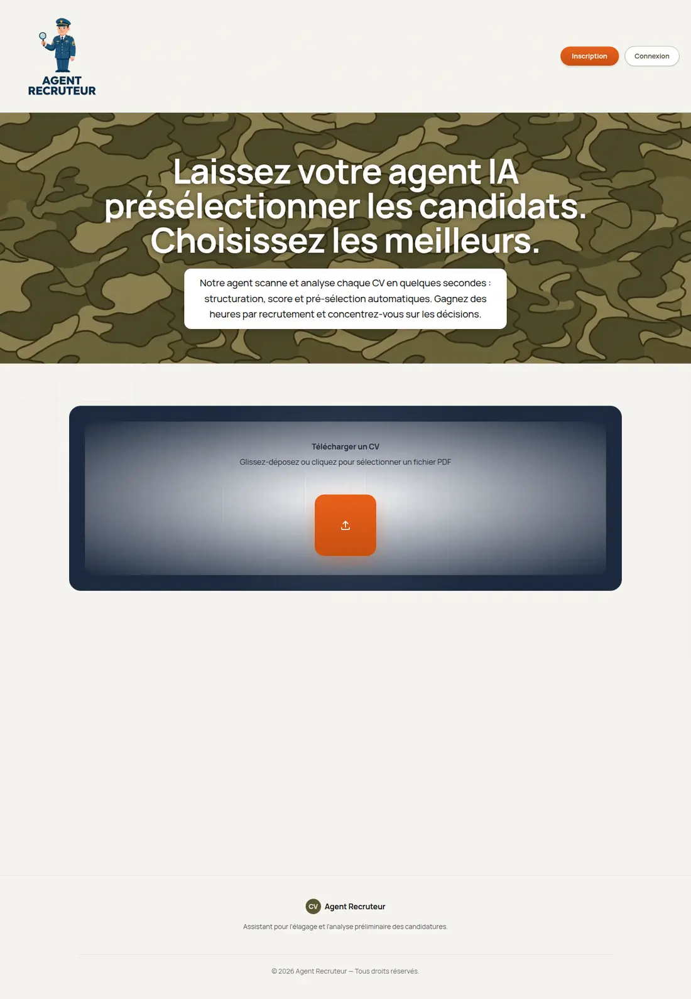

# 🚧 CV Inspector — Agent Recruteur

Assistant IA de pré-sélection de CV pour le marché français : un recruteur dépose un CV
en PDF, l'agent l'extrait, le structure (compétences, expériences, formation), lui
attribue un score et répond aux questions posées sur le candidat.



- **Une seule app Next.js** (App Router, TypeScript, Tailwind) : l'UI et l'API (`/api/*`)
  vivent dans le même serveur — un process, un port.
- **LLM** : GPT-5.5 via la Responses API d'OpenAI.
- **Persistance** : MongoDB Atlas, avec repli automatique en mémoire si la base est
  injoignable.
- **Exploitation** : données candidats servies derrière un jeton (fail-closed en
  production), bornes d'ingestion, déduplication des CV par empreinte SHA-256.

```bash
pnpm install && pnpm dev   # http://localhost:3000
```

> Dépôt public dans un but de **revue technique** : décisions d'architecture, posture
> sécurité et garde-fous d'exploitation.